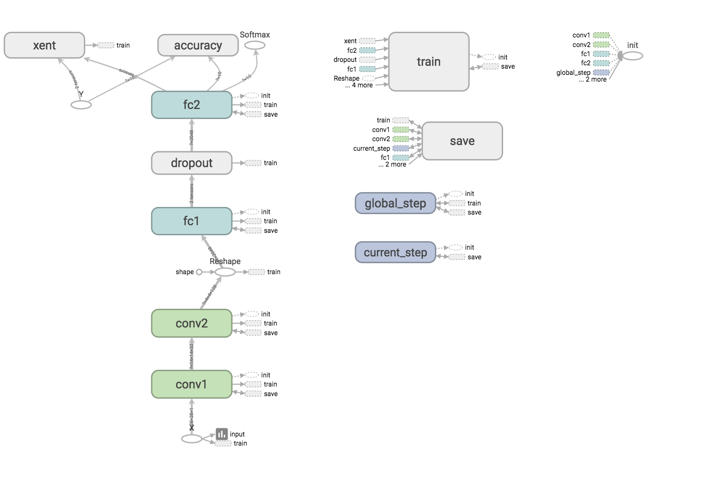
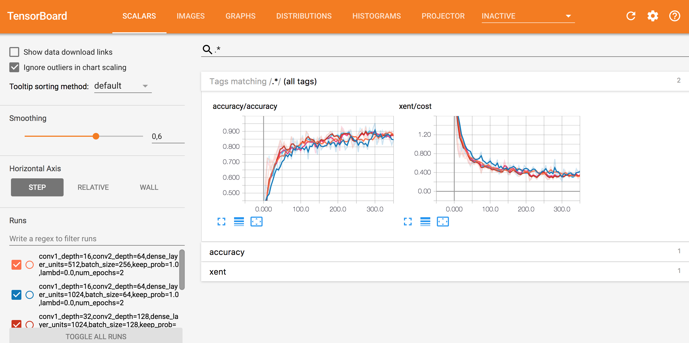
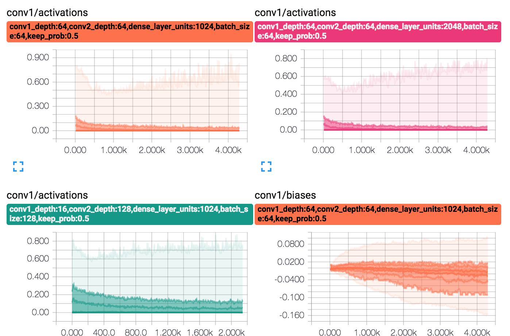
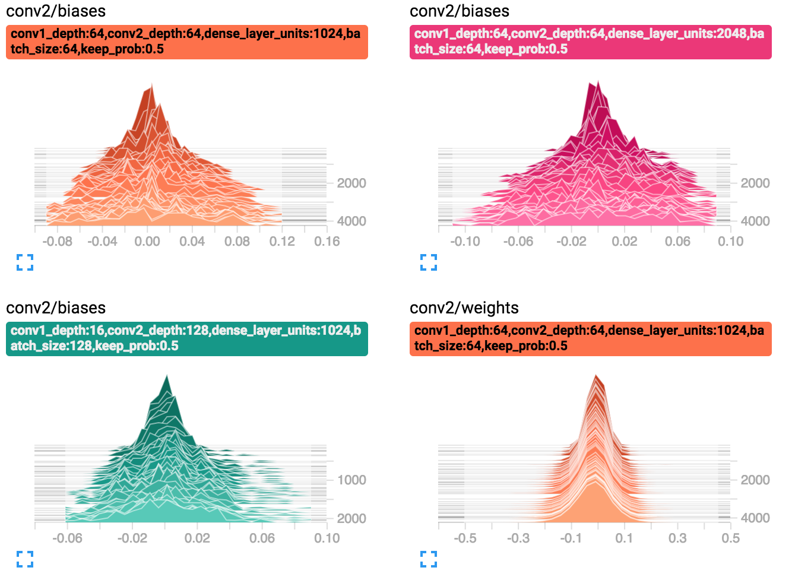
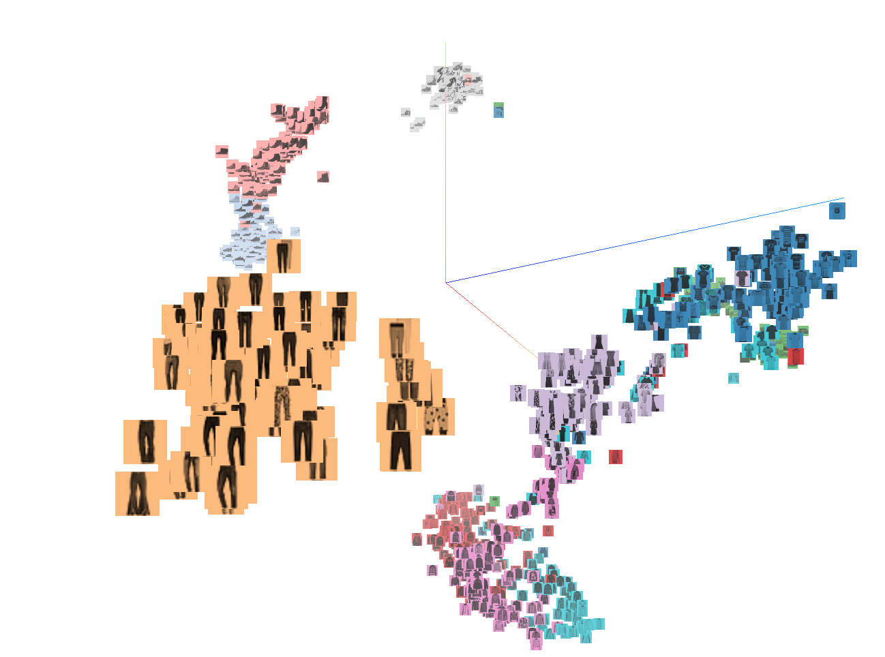

# Fashion-Classifier

`Fashion-Classifier` is a proof-of-concept classifier for [Fashion-MNIST Zalando's dataset](https://github.com/zalandoresearch/fashion-mnist), to test some deep learning techiniques as well as some technologies such as Tensorflow and Tensorboard. I'm using Zalando's dataset instead of the classic [MNIST dataset](http://yann.lecun.com/exdb/mnist/) because there are already so many MNIST Tensorflow tutorials out there and because it was a lot more challenging than MNIST.

## Architecture
I decided to start with a slightly modified [LeNet-5](http://yann.lecun.com/exdb/lenet/) architecture. It is a very simple and well known convolutional neural network architecture that is easy to implement and usually gives good results out of the box to start with. 

I've done three main modifications to the original LeNet-5: 

* I'm using _ReLU_ as activation function instead of _tanh_ 
* The depths of the convolutional layers.
* The humber of hidden units of the fully connected layer.



## Hyperparameters search

To fine tune the model and explore the hyperparameters space, I've implemented a few helper functions in `hparams_search.py` to perform random grid search following a coarse to fine approach.

`hparams_search.py` usage:
* `--logdir` path to dir where log/model files will be stored.
* `--hparams_path` path to json file that specifies the values of the hyperparameters to train.
* `--grid_size` indicates the number of hyperparameter combinations to test from all the possible combinations.

```
$ python hparams_search.py --logdir /tmp/fashion-classifier/coarse/ \
  --hparams_path coarse.json --grid_size 10
```

The grid of hyperparameters to explore are specified in a json file with the name of each hyperparameter and a list of possible values. For example:

```
{
    "conv1_depth": [16, 32, 64],
    "conv2_depth": [32, 64, 128],
    "dense_layer_units": [512, 1024, 2048],
    "batch_size": [64, 128, 256, 512],
    "keep_prob": [0.4, 0.5, 0.6],
    "num_epochs": [5]
}
```

A cartesian product is applied to every hyperparameter list of values to generate all possible combinations. The list of all possible combinations is randomized and the `--grid_size` argument limits the number of combinations to try.

By launching Tensorboard with the same `--logdir` argument as `hparams_search.py`, you can visualize the train accuracy, cross entropy cost,and the data distribution of weights and biases as the model gets trained. It's very usefull to debug and compare the performance of the model with different hyperparameters.



## Data augmentation
To reduce overfitting I've implemented two methods to synthetically generate more examples:

* Random horizontal flip.
* Random crop with resize.

The percentage of the total examples to apply these transformations is controlled by the hyperparameter `augment_percent`, i.e. `augment_percent=0.1` means 10% random horizontal flips and 10% random crops with resize, thus 20% more images.

## Visualizations
Apart from the accuracy and cost graphs I've also included histograms and embeddings which allows the following visualizations in Tensorboard:

* Distributions
* Histograms
* t-SNE and PCA visualizations





t-SNE visualizations, apart from being a nice visualization to include in a README, could be very useful to debug the model performance. [Here](https://distill.pub/2016/misread-tsne/) you can find a few tips on how to use it more effectively. 

## Usage
Once you've found a good set of hyperparameters, you can use `fashion_classifier.py` to train and evaluate your model:

```
$ python fashion_classifier.py train \
--hparams conv1_depth=32,conv2_depth=64,dense_layer_units=1024,batch_size=128,keep_prob=0.6,augment_percent=0.1,num_epochs=5 \
--logdir /tmp/fashion-classifier/ --embedding_size 1024
```

Model checkpoints are saved in the `--logdir` path. This allows you to resume training if you stopped the execution or if you want to train the model longer by increasing the `num_epochs` hyperparameter. To resume training, use the same `--logdir` path and add the argument `--resume_training`. 

```
$ python fashion_classifier.py train \
--hparams conv1_depth=32,conv2_depth=64,dense_layer_units=1024,batch_size=128,keep_prob=0.6,augment_percent=0.1,num_epochs=5 \
--logdir /tmp/fashion-classifier/ --embedding_size 1024 --resume_training
```

It's also possible to load and evaluate a previously trained model with the following command:

```
$ python fashion_classifier.py load \
--hparams conv1_depth=32,conv2_depth=64,dense_layer_units=1024,batch_size=128,keep_prob=0.6,augment_percent=0.1 \
--logdir /tmp/fashion-classifier/
```

It's important to note that when resuming training or loading a model, you can't modify the network architecture (i.e. conv1_depth, conv2_depth and dense_layer_units must be the same as specified in the original training).

## Results
Since I've being training the model in my Macbook with no GPU acceleration, I haven't been able to explore a big enough set of hyperparameters, as each iteration cycle could be in the order of hours. That said, I was able to achieve _98.11%_ accuracy in the train dataset and _92.26%_ in the test dataset training the model for 20 epochs with the following hyperparameters:

```
$ python fashion_classifier.py train \
--hparams conv1_depth=32,conv2_depth=64,dense_layer_units=1024,batch_size=128,keep_prob=0.6,augment_percent=0.3,num_epochs=20 \
--logdir /tmp/fc/logdir/conv1_depth=32,conv2_depth=64,dense_layer_units=1024,batch_size=128,keep_prob=0.6,augment_percent=0.3
```

The test accuracy is definitely not state-of-the-art and could be easily improved a bit with the same CNN architecture, but using more computation resources to fine tune the model and train it longer.

## Conclusions
It was relativelly easy to train a model that at least could learn the train dataset well (avoidable bias reduction). The resulting model was clearly overfitting the train dataset and not generalizing well enough. However, reducing the overfitting was a much more challenging problem. Dropout regularization and data augmentation helped a bit, but probably LeNet-5 was not the ideal architecture for this concrete dataset. Some of the dataset classes were very similar to each other (e.g. ankle boots and sneakers, dresses and coats), so a slightly more sophisticated and deeper model like [AlexNet](http://vision.stanford.edu/teaching/cs231b_spring1415/slides/alexnet_tugce_kyunghee.pdf) would probably perform better.

Training the model on a Macbook with no GPU acceleration was far from ideal too, and in the future I will definitely invest some time to setup an easy way to run these experiments on AWS spot instances or in Google Cloud. Either way, if you are using a Macbook and still want to run these experiments or similar ones, I definitely recommend that you compile Tensorflow from source, as it will enable some CPU optimizations that are not enabled in the binary package and that make a big difference.
